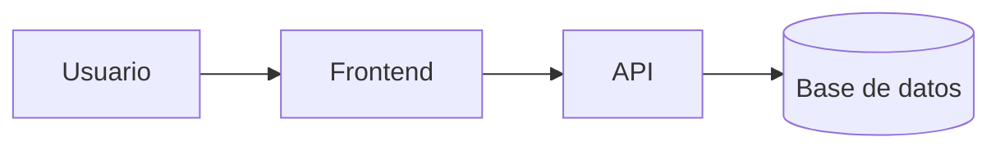

# Laboratorio README
 
Proyecto de práctica para aprender Markdown avanzado en GitHub.
 
## Descripción
 
Este repositorio documenta paso a paso mi aprendizaje de Markdown:
tablas, listas de tareas, badges y diagramas.
## Estado de funcionalidades
 
| Función  | Estado      |
|----------|-------------|
| Login    | Listo       |
| Reportes | En progreso |
## Pendientes
 
- [x] Diseño de la base de datos
- [ ] Pruebas unitarias

## Arquitectura
 

##


# Sistema de Gestión de Biblioteca


Una aplicación para gestionar el préstamo de libros, registro de usuarios y control de inventario en una biblioteca local.

---

## Tabla de contenidos

- [Descripción](#descripción)
- [Instalación](#instalación)
- [Uso](#uso)
- [Estado del proyecto](#estado-del-proyecto)
- [Arquitectura](#arquitectura)
- [Contribuidores](#contribuidores)

---

## Descripción

Este proyecto busca automatizar el control de entradas y salidas de libros en una biblioteca pública. Permite consultar disponibilidad en tiempo real y gestionar usuarios de forma eficiente.

---

## Instalación

```bash
git clone [https://github.com/leoriv-cyber/Laboratorio-5.git](https://github.com/leoriv-cyber/Laboratorio-5.git)
cd Laboratorio-5
npm installS